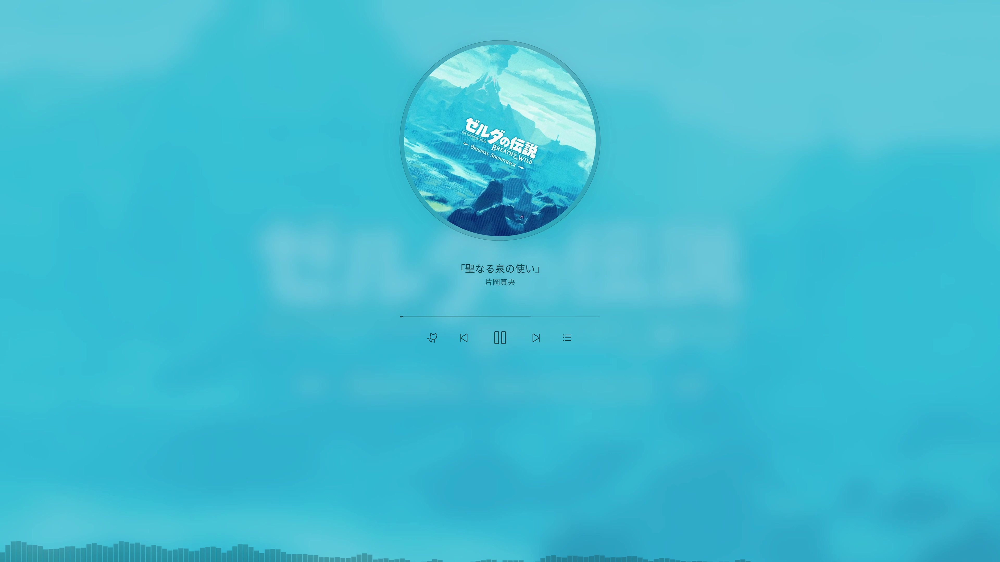
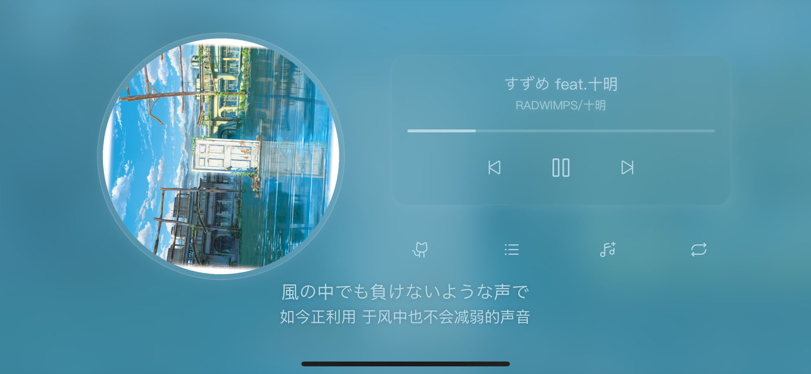
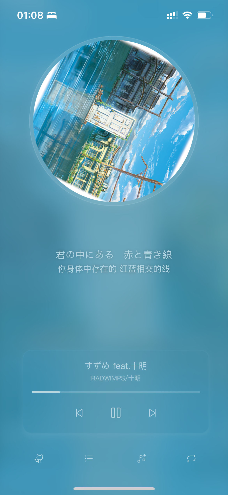

# Rynkis' FM

一个支持语音合成和私有曲库的个性化音乐流媒体服务。  
亦或称作网抑云的私人增强版。(ง๑ •̀_•́)ง


## 功能特性

- **语音合成**: 在歌单中生成 FM 语音（通过歌单描述实现）
- **私有曲库**: 在无版权无 VIP 权限或未收入曲目时使用私有服务器资源
- **灵活部署**: 可通过环境变量自定义配置在 Vercel 上一键部署
- **体验优雅**: 支持多媒体控制中心（Chrome 右上角、Windows 11 右下角、iOS 等多平台）
- **API 缓存**: 可选的缓存系统提升性能

## 环境配置

测试或部署前请根据运行环境新建 `.env` 文件：

- `SERVER_NAME`: 音乐服务运营商（目前仅支持网易云音乐）
- `SERVER_PLAYLIST`: 个人播放列表
- `SERVER_PLAYLIST_PL`: 播放列表 API 参数白名单（可用于共享接口给其它音乐应用）
- `SERVER_PRIVATE`: 私有曲库服务器 URL，使用私有曲库功能时需配置
- `NO_CACHE`: 是否启用 API 缓存（海外部署建议开启）

## 语音合成功能

在歌单简介中输入特定格式即可启用：

```
[位置]: [内容]  // [位置] 为插入音乐位置（从 0 开始），[内容] 为语音合成文本
```

示例：
```
0: Hello，你好，这里是rynkis' FM发出的第一句问候。
```

## 私有曲库功能

在歌单简介中输入特定格式即可启用：

```
r[位置]: [文件名]  // [位置] 为插入音乐位置，[文件名] 为音频文件名（不含扩展名）
```

示例：
```
r0: Spotlight (feat. Yui Mugino)
```

## iOS 桌面书签功能

使用 iOS 桌面书签功能可以从手机桌面点击图标全屏运行 Web 应用。


## 快速开始

```bash
git clone https://github.com/Shy07/fm.rynkis.com.git
cd fm.rynkis.com
cp .env.sample .env.local
yarn install
yarn dev
```

打开 http://localhost:3000 即可体验！

## 部署指南

### Vercel 部署

最简单的方式是使用 [Vercel 平台](https://vercel.com/new?utm_medium=default-template&filter=next.js&utm_source=create-next-app&utm_campaign=create-next-app-readme)进行部署。

更多细节请参考 [Next.js 部署文档](https://nextjs.org/docs/deployment)。

## 更新日志

- 重写播放器样式
- 添加私有曲库功能
- 添加语音合成功能
- 添加 `navigator.mediaSession` 数据
- 使用 Vercel KV 缓存网易云 API 数据
- 使用 Next.js 重写项目
- 使用 webpack 打包前端资源
- 使用 jQuery + ES6 重写播放器
- 使用 Ruby 和 Sinatra 服务器重写 API

# Rynkis' FM

A personalized music streaming service with text-to-speech integration and private music library support.  
Think of it as an enhanced, private version of Netease Cloud Music. (ง๑ •̀_•́)ง



## Features

- **Text-to-Speech**: Generate FM voice in playlists (via playlist descriptions)
- **Private Music Library**: Use private server resources for songs without copyright, VIP restrictions, or unavailable tracks
- **Flexible Deployment**: One-click deployment on Vercel with customizable environment variables
- **Elegant Experience**: Supports multimedia control center (Chrome top-right, Windows 11 bottom-right, iOS, and multiple platforms)
- **API Caching**: Optional caching system for improved performance

## Environment Configuration

Before testing or deployment, create a `.env` file based on your environment:

- `SERVER_NAME`: Music service provider (currently only Netease Cloud Music is supported)
- `SERVER_PLAYLIST`: Personal playlist
- `SERVER_PLAYLIST_PL`: Playlist API parameter whitelist (can be used to share the API with other music applications)
- `SERVER_PRIVATE`: Private music library server URL (required when using the private library feature)
- `NO_CACHE`: Whether to enable API caching (recommended for overseas deployments)

## Text-to-Speech Feature

Input a specific format in the playlist description to enable:

```
[Position]: [Content]  // [Position] is the insertion point in the playlist (starting from 0), [Content] is the text for speech synthesis
```

Example:
```
0: Hello，你好，这里是rynkis' FM发出的第一句问候。
```

## Private Music Library Feature

Input a specific format in the playlist description to enable:

```
r[Position]: [Filename]  // [Position] is the insertion point, [Filename] is the audio filename (without extension)
```

Example:
```
r0: Spotlight (feat. Yui Mugino)
```

## iOS Home Screen Bookmark Feature

Use the iOS home screen bookmark feature to run the web application fullscreen directly from your phone's home screen.




## Quick Start

```
git clone https://github.com/Shy07/fm.rynkis.com.git
cd fm.rynkis.com
cp .env.sample .env.local
yarn install
yarn dev
```
Then open http://localhost:3000 in your web browser and enjoy!  

### Deploy on Vercel

The easiest way to deploy your Next.js app is to use the [Vercel Platform](https://vercel.com/new?utm_medium=default-template&filter=next.js&utm_source=create-next-app&utm_campaign=create-next-app-readme) from the creators of Next.js.

Check out [Next.js deployment documentation](https://nextjs.org/docs/deployment) for more details.

## Changelog

- Redesigned player UI
- Added private music library feature
- Added text-to-speech feature
- Added `navigator.mediaSession` data support
- Implemented Vercel KV caching for Netease Cloud Music API data
- Rewrote the project using Next.js
- Bundled frontend resources with webpack
- Rewrote the player using jQuery + ES6
- Rewrote the API using Ruby and Sinatra server
